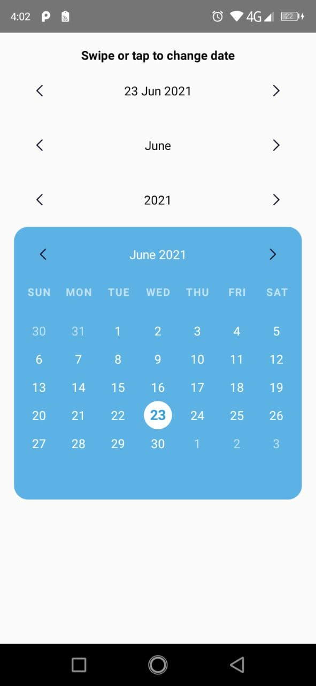

# react-native-simple-calendar

React Native calendar component and date slider

## Installation

`npm i react-native-simple-calendar`



## Usage

```javascript
import React, {useState} from 'react';
import {StatusBar, View} from 'react-native';
import {Calendar, DateSlider} from '../dist';
import dayjs from 'dayjs';

const App = () => {
  const [date, setDate] = useState(dayjs());

  return (
    <View>
      <DateSlider
        date={date}
        setDate={setDate}
        type="day"
        format="D MMM YYYY"
      />
      <DateSlider date={date} setDate={setDate} type="month" format="MMMM" />
      <DateSlider date={date} setDate={setDate} type="year" format="YYYY" />
      <Calendar date={date} setDate={setDate} />
    </View>
  );
};

export default App;

```

## DateSlider Methods

#### setDate(date)

| Params | Type  | Description  |
| ------ |:-----:| ------------ |
| date   | Dayjs | Selected date |

## DateSlider Props

| Name      | Type          | Default    | Description  |
| --------- |:-------------:| ---------- | ------------ |
| date      | Dayjs         | today date | Date value in dayjs lib format |
| type      | string        | 'month'    | 'day', 'month' or 'year' |
| format    | string        | 'MMMM'     | Date format ([https://day.js.org/docs/en/display/format]) |
| iconProps | SvgProps      | -          | Props of arrow icons (width, height, viewBox, preserveAspectRatio, color, title) |
| textStyle | TextStyle     | -          | React native text style |
| style     | ViewStyle     | -          | React native view style |